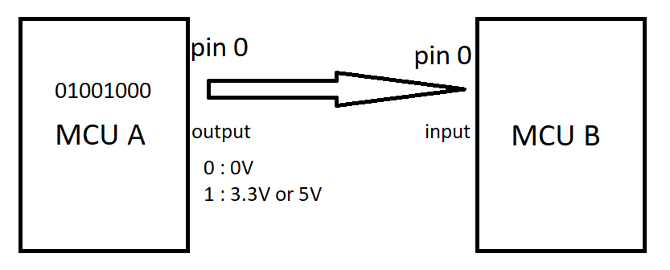

# Bài 1: Các Chuẩn Giao Tiếp Cơ Bản
Tại sao phải sử dụng các chuẩn giao tiếp để truyền nhận dữ liệu?

+ Thực chất việc truyền dữ liệu chính là truyền các bit 0 1 từ MCU này qua MCU khác hoặc các thiết bị khác.
+ Các bit 0 1 này để truyền được thực chất chính là truyền các tín hiệu điện áp trên các chân của vi điều khiển
+ Nhưng nếu MCU A gửi 3 bit 0 liên tiếp nhau thì làm cách nào để MCU B biết được là MCU A gửi 3 bit 0 liên tiếp trong khi MCU B chỉ biết được điện áp lúc này đang được kéo xuống mức 0?

-> Đó chính là lí do con người phát minh ra các chuẩn giao tiếp mục đích là để việc truyền nhận dữ liệu trở nên dễ dàng và chính xác hơn.

## 1, SPI
SPI (Serial Peripheral Interface) là một chuẩn giao tiếp truyền thông nối tiếp được sử dụng phổ biến trong các hệ thống nhúng để trao đổi dữ liệu giữa vi điều khiển và các thiết bị ngoại vi, như cảm biến, màn hình, bộ nhớ flash, và các module giao tiếp khác. 

**Đặc điểm**: Là chuẩn giao tiếp nối tiếp đồng bộ, Hoạt động ở chế độ song công, sử dụng ít nhất 4 dây.

a, **Cấu trúc**

SPI sử dụng 4 dây cơ bản:

+ SCLK (Serial Clock): Tín hiệu xung clock do master cung cấp để đồng bộ việc truyền dữ liệu.
+ MOSI (Master Out Slave In): Dòng dữ liệu từ master đến slave.
+ MISO (Master In Slave Out): Dòng dữ liệu từ slave đến master.
+ SS (Slave Select): Tín hiệu chọn slave, dùng để kích hoạt (kéo xuống mức 0) hoặc ngắt kết nối (kéo lên mức 1) với các thiết bị slave.

b, **Quá trình truyền dữ liệu**

+ đầu tiên Master sẽ kéo chân CS tương ứng với Slave được truyền dữ liệu xuống mức 0 để bắt đầu cho việc truyền dữ liệu.
+ Master sẽ cung cấp xung clock, cứ với mỗi xung clock thì một bit dữ liệu sẽ được truyền. Đây là lí do SPI được gọi là giao thức đồng bộ
+ Các thanh ghi 2 hai bên sẽ liên tục dịch các bit để cập nhật giá trị truyền và nhận.
+ Hai thiết bị có thể đồng thời truyền và nhận giá trị cùng một thời điểm. Đó cũng là lí do SPI được gọi là giao thức truyền song công.

c, **Các chế độ truyền** 

SPI có 4 chế độ truyền dựa vào xung clock (CPOL) và thời điểm truyền nhận dữ liệu (CPHA)

ví dụ với MODE 0: Xung clock được cấp ban đầu là ở mức thấp và thời điểm truyền nhận dữ liệu chính là cạnh lên của xung clock.

d, **Ưu điểm**

+ Tốc độ cao: SPI thường có tốc độ truyền dữ liệu nhanh hơn so với các chuẩn như I2C do không cần xung nhịp đồng bộ phức tạp.
+ Giao tiếp full-duplex: Cả master và slave có thể truyền và nhận dữ liệu đồng thời.
+ Không cần địa chỉ hóa: Mỗi slave có một chân SS riêng để master chọn thiết bị cần giao tiếp.

## 2, I2C
I2C (Inter-Integrated Circuit) là một chuẩn giao tiếp nối tiếp được sử dụng để kết nối vi điều khiển với các thiết bị ngoại vi, như cảm biến, màn hình, EEPROM, và nhiều thiết bị khác.

**Đặc điểm:** I2C là chuẩn giao tiếp đồng bộ, bán song công và sử dụng hai dây.

a, **Cấu trúc của I2C**

+ SDA (Serial Data Line): Đường dữ liệu nối tiếp dùng để truyền tải dữ liệu giữa master và slave.
+ SCL (Serial Clock Line): Đường xung clock do master tạo ra để đồng bộ việc truyền dữ liệu.

b, **Quá trình truyền dữ liệu** 

+ Để bắt đầu giao tiếp, master kéo đường SDA xuống mức thấp trong khi SCL vẫn ở mức cao. Điều này báo hiệu cho các thiết bị slave rằng một chu kỳ giao tiếp sắp bắt đầu.
+ Sau khi điều kiện bắt đầu được thiết lập, master sẽ gửi một byte địa chỉ (7 bit hoặc 10 bit) để chọn thiết bị slave mà nó muốn giao tiếp. Bit thứ 8 trong byte này là bit đọc/ghi (Read/Write - R/W), cho biết master sẽ đọc dữ liệu từ slave hay ghi dữ liệu vào slave.

    + 0: Ghi (Write) - master gửi dữ liệu đến slave.
    + 1: Đọc (Read) - master đọc dữ liệu từ slave.
+ Sau khi nhận byte địa chỉ, slave phản hồi bằng cách kéo đường SDA xuống mức thấp để gửi tín hiệu ACK (Acknowledge) cho master. Điều này cho biết slave đã nhận địa chỉ và sẵn sàng giao tiếp.
Nếu slave không nhận được hoặc không có phản hồi, master sẽ nhận được tín hiệu NACK (Not Acknowledge), và quá trình truyền có thể dừng lại hoặc thử lại.
+ **Master gửi dữ liệu**: Nếu master muốn gửi dữ liệu đến slave (ghi), nó sẽ tiếp tục gửi các byte dữ liệu trên SDA. Sau mỗi byte dữ liệu, slave sẽ gửi tín hiệu ACK để xác nhận đã nhận dữ liệu thành công.
+ **Slave gửi dữ liệu**: Nếu master yêu cầu đọc dữ liệu từ slave, slave sẽ gửi các byte dữ liệu qua SDA, và master sẽ gửi tín hiệu ACK sau mỗi byte để cho phép slave tiếp tục gửi dữ liệu.
+ Khi master đã hoàn thành việc truyền hoặc nhận dữ liệu, nó sẽ gửi điều kiện Stop, kéo SDA lên mức cao khi SCL vẫn ở mức cao, kết thúc quá trình truyền.

c, Ưu điểm 
+ Tiết kiệm dây: Chỉ cần 2 dây (SDA và SCL) để kết nối với nhiều thiết bị, giúp giảm số lượng chân I/O của vi điều khiển.
+ Địa chỉ hóa thiết bị: I2C cho phép master giao tiếp với nhiều slave thông qua địa chỉ hóa, hỗ trợ mở rộng hệ thống.

## 3, UART
UART (Universal Asynchronous Receiver/Transmitter) là một chuẩn giao tiếp nối tiếp được sử dụng rộng rãi trong các hệ thống nhúng và các ứng dụng truyền dữ liệu.

**Đặc điểm:** Giao tiếp không đồng bộ, truyền song công, sử dụng 2 dây.

a, **Cấu trúc của UART**

+ **TX (Transmit)**: Dùng để truyền dữ liệu từ thiết bị này sang thiết bị khác.
+ **RX (Receive)**: Dùng để nhận dữ liệu từ thiết bị khác.

UART hoạt động theo cơ chế giao tiếp không đồng bộ, tức là không có tín hiệu xung clock chung giữa các thiết bị truyền và nhận. Thay vào đó, cả hai thiết bị phải thiết lập cùng một tốc độ truyền dữ liệu (baud rate) để đồng bộ hóa.

b, **Quá trình truyền nhận dữ liệu** 

Dữ liệu được truyền trong một khung chứa các thành phần:

+ Bit bắt đầu (Start Bit): Là bit đầu tiên được truyền, và luôn là mức thấp (0). Bit này báo cho thiết bị nhận rằng có một byte dữ liệu sắp được truyền.
+ Dữ liệu (Data Bits): Sau bit bắt đầu, các bit dữ liệu được truyền. Thông thường là 8 bit (1 byte), nhưng cũng có thể là 5, 6, 7, hoặc 9 bit tùy theo cấu hình.
+ Bit chẵn lẻ (Parity Bit) (Tùy chọn): Là một bit kiểm tra lỗi giúp phát hiện sự thay đổi không mong muốn của dữ liệu trong quá trình truyền. Có thể là kiểm tra chẵn hoặc lẻ, hoặc bỏ qua nếu không sử dụng.
+ Bit dừng (Stop Bit): Đánh dấu kết thúc của một khung dữ liệu. Bit này thường là mức cao (1). Có thể là 1, 1.5, hoặc 2 bit dừng tùy cấu hình.

Vì không sử dụng xung clock nên UART muốn đồng bộ dữ liệu truyền thì cần phải sử dụng BAUD RATE. Tốc độ truyền dữ liệu được xác định bằng baud rate, tức là số bit được truyền mỗi giây. Ví dụ, baud rate 9600 nghĩa là 9600 bit dữ liệu được truyền mỗi giây.
Cả hai thiết bị truyền và nhận phải được cấu hình với cùng một baud rate để đảm bảo đồng bộ hóa.

c, **Ưu điểm**
+ **Đơn giản**: UART là giao thức dễ sử dụng và cài đặt, phổ biến trong nhiều thiết bị vi điều khiển và máy tính.
+ **Không cần xung clock**: Giao tiếp không đồng bộ, không cần dây xung clock chung giữa các thiết bị, giúp đơn giản hóa kết nối.
+ **Kiểm tra lỗi**: UART hỗ trợ tính năng kiểm tra lỗi bằng bit chẵn lẻ (tùy chọn). 
# Embedded-in-Automotive
